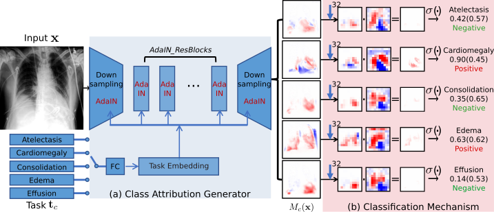
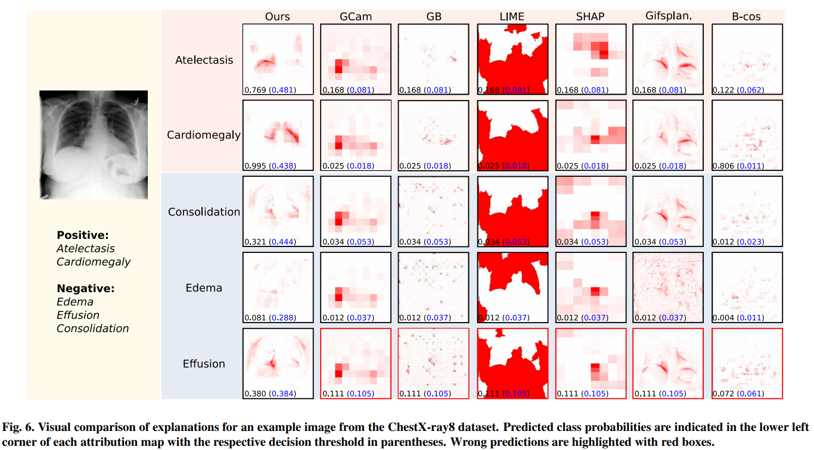
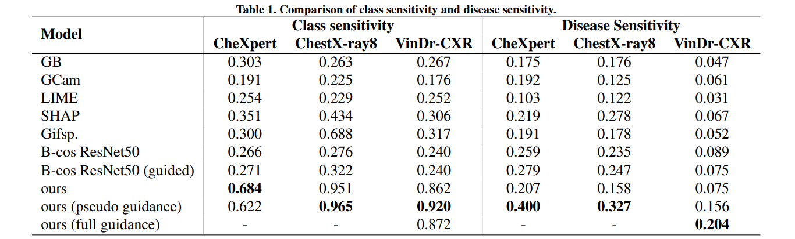

# Attri-Net V2
An improved version of Attri-Net model, for the manuscript **Attri-Net: A Globally and Locally Inherently Interpretable Model for Multi-Label Classification Using Class-Specific Counterfactuals** submitted to Medical Image Analysis.

Original Attri-Net is published in  MIDL 2023 (https://arxiv.org/abs/2303.00500).

## Improvement of Attri-Net V2:
- The added global explanations explain the whole model's prediction mechanism.
- The improved local explanations become more straightforward.
- The proposed model guidance mechanism encourages the model to be **right for the right reason**.
- We performed a more comprehensive quantitative evaluations of local and global explanations.


## Model overview
<div style="displaystyle=block;align=center;"><p align="center" >
  
  </p>
</div>


## Results

### Qualitative evaluation

### Quantitative evaluation

<div style="displaystyle=block;align=center;"><p align="center" >
  
  </p>
</div>

<div style="displaystyle=block;align=center;"><p align="center" >
  
  </p>
</div>


## Installation
```
conda create -n attrinet python=3.10
pip install -r requirements.txt
```

## Datasets
We perform evaluations with the following three Chest X-ray datasets.

**CheXpert** (https://stanfordmlgroup.github.io/competitions/chexpert/)

**CheXlocalize** (https://stanfordaimi.azurewebsites.net/datasets/23c56a0d-15de-405b-87c8-99c30138950c) 

This dataset provides radiologist-annotated segmentations for 234 chest X-rays from 200 patients and 668 chest X-rays from 500 patients from the CheXpert validation and test sets.

**ChestX-ray8** (https://nihcc.app.box.com/v/ChestXray-NIHCC)

**VinDr-CXR** (https://vindr.ai/datasets/cxr)


## Other Models

We compared Attri-Net with the black model Resnet50 and an inherent interpretable model B-cos Networks. We adapted the models slightly to our task settings (i.e the number of classes in the output is set to the number of diseases we trained on which is 5).

**Resnet50** We use the PyTorch implementation of [resnet50](https://pytorch.org/vision/stable/models.html) in torchvision.models subpackage without using pretrained weights.

**B-cos Networks** We use the official implementation of [B-cos Resnet50](https://github.com/B-cos/B-cos-v2/blob/main/bcos/models/resnet.py) to train on all three datasets.


# References
If you use any of the code in this repository for your research, please cite as:
```
  @misc{sun2023inherently,
      title={Inherently Interpretable Multi-Label Classification Using Class-Specific Counterfactuals}, 
      author={Susu Sun and Stefano Woerner and Andreas Maier and Lisa M. Koch and Christian F. Baumgartner},
      year={2023},
      eprint={2303.00500},
      archivePrefix={arXiv},
      primaryClass={cs.CV}
}
```
